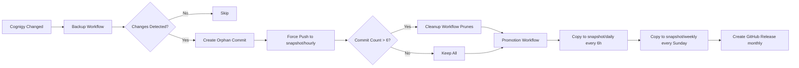

# Cognigy Backup System Architecture

Technical deep-dive into the implementation, design decisions, and internals of the backup system.

---

## Table of Contents

- [System Overview](#system-overview)
- [Storage Strategy](#storage-strategy)
- [Workflow Architecture](#workflow-architecture)
- [Configuration System](#configuration-system)
- [Security Model](#security-model)
- [Performance & Optimization](#performance--optimization)
- [Troubleshooting & Debugging](#troubleshooting--debugging)

---

## System Overview

### Design Principles

1. **Storage Efficiency**: Use orphan branches to avoid exponential growth
2. **Time-Decay Retention**: Keep more recent backups, fewer older ones
3. **Zero-Touch Operation**: Fully automated after initial setup
4. **Safety First**: Dry-run mode, approval gates, change detection
5. **Configurability**: Customizable retention policies per project

### Architecture Diagram

```
┌─────────────────────────────────────────────────────────────┐
│ Cognigy.AI Platform                                          │
│  ┌──────────────┐                                           │
│  │ Your Project │ ←──────┐                                  │
│  │   (Agent)    │        │                                  │
│  └──────────────┘        │                                  │
└──────────────────────────┼──────────────────────────────────┘
                            │
                    cognigy clone / restore
                            │
                            ↓
┌─────────────────────────────────────────────────────────────┐
│ GitHub Actions Workflows                                     │
│                                                              │
│  ┌─────────────┐    ┌──────────────┐    ┌────────────┐    │
│  │   Backup    │ →  │  Promotion   │ →  │  Cleanup   │    │
│  │ (every 30m) │    │ (6h/weekly)  │    │  (daily)   │    │
│  └─────────────┘    └──────────────┘    └────────────┘    │
└──────────────────────────┼──────────────────────────────────┘
                            │
                            ↓
┌─────────────────────────────────────────────────────────────┐
│ GitHub Repository (Storage)                                  │
│                                                              │
│  main branch                                                 │
│  ├── .github/workflows/    (Automation)                     │
│  ├── docs/                 (Documentation)                  │
│  ├── scripts/              (Setup tools)                    │
│  └── config.json           (Configuration)                  │
│                                                              │
│  snapshot/hourly (orphan)                                   │
│  ├── commit 6 (30 min ago)                                  │
│  ├── commit 5 (1 hour ago)                                  │
│  ├── ...                                                    │
│  └── commit 1 (3 hours ago)                                 │
│                                                              │
│  snapshot/daily (orphan)                                    │
│  ├── commit 7 (yesterday)                                   │
│  ├── ...                                                    │
│  └── commit 1 (7 days ago)                                  │
│                                                              │
│  snapshot/weekly (orphan)                                   │
│  └── ...                                                    │
│                                                              │
│  GitHub Releases (monthly archives)                         │
│  └── monthly-2024-10, monthly-2024-09, ...                  │
└─────────────────────────────────────────────────────────────┘
```

---

## Storage Strategy

### Orphan Branch Approach

**Why Orphan Branches?**

Traditional git history creates a chain:
```
A ← B ← C ← D ← E (cumulative growth)
```

Orphan branches are independent:
```
A (standalone)
B (standalone)
C (standalone)
```

**Storage Impact:**

| Approach | 1 Year Storage | Growth Pattern |
|----------|----------------|----------------|
| Normal Git | 5 GB+ | Exponential (every change adds to history) |
| Orphan Branches | ~145 MB | Fixed (only N snapshots retained) |

### Snapshot Lifecycle



### Data Flow

1. **Backup Workflow** (every 30 min):
   ```bash
   cognigy clone → agent/ directory
   git checkout --orphan temp-snapshot
   git add -f agent/  # Force add (ignored on main)
   git commit -m "Snapshot: $(date)"
   git push -f origin temp-snapshot:snapshot/hourly
   ```

2. **Promotion Workflow** (scheduled):
   ```bash
   # Every 6 hours: hourly → daily
   git checkout snapshot/hourly
   git branch -f snapshot/daily
   git push -f origin snapshot/daily

   # Every Sunday: daily → weekly
   git checkout snapshot/daily
   git branch -f snapshot/weekly
   git push -f origin snapshot/weekly

   # Monthly: weekly → GitHub Release
   gh release create "monthly-$(date +%Y-%m)" --target snapshot/weekly
   ```

3. **Cleanup Workflow** (daily):
   ```bash
   # Prune old commits from hourly branch
   git checkout snapshot/hourly
   COMMITS=$(git rev-list HEAD | head -n 6)
   # Keep only those 6 commits, remove rest
   git reflog expire --expire=now --all
   git gc --prune=now --aggressive
   ```

### Storage Math

**Per-snapshot size**: ~5 MB (average Cognigy project)

**Total storage**:
- Hourly: 6 snapshots × 5 MB = 30 MB
- Daily: 7 snapshots × 5 MB = 35 MB
- Weekly: 4 snapshots × 5 MB = 20 MB
- Monthly: 12 releases × 5 MB = 60 MB
- **Total: ~145 MB**

**With git compression**: Often smaller due to delta compression between similar commits

---

## Workflow Architecture

### 1. Backup Workflow (`backup.yml`)

**Trigger:**
- Schedule: `cron: '*/30 * * * *'` (every 30 min, configurable)
- Manual: `workflow_dispatch`

**Steps:**

```yaml
1. Checkout main branch
2. Read config.json
3. Install Cognigy CLI
4. Set environment variables from secrets
5. Run cognigy clone
6. Detect changes (git diff)
7. If changes:
   a. Create orphan branch
   b. Force-add agent/ directory
   c. Add metadata file
   d. Commit with timestamp
   e. Force-push to snapshot/hourly
8. Log metrics (snapshot size, duration, changes)
```

**Change Detection:**

```bash
# After cognigy clone
if git diff --quiet agent/; then
  echo "No changes detected, skipping snapshot"
  exit 0
fi
```

This prevents creating redundant snapshots when nothing changed.

### 2. Promotion Workflow (`promote.yml`)

**Triggers:**
- `cron: '0 */6 * * *'` - Every 6 hours (hourly → daily)
- `cron: '0 0 * * 0'` - Every Sunday (daily → weekly)
- `cron: '0 0 1 * *'` - First of month (weekly → monthly)

**Logic:**

```yaml
jobs:
  promote_daily:
    if: github.event.schedule == '0 */6 * * *'
    steps:
      - Checkout snapshot/hourly
      - Copy to snapshot/daily (force-push)

  promote_weekly:
    if: github.event.schedule == '0 0 * * 0'
    steps:
      - Checkout snapshot/daily
      - Copy to snapshot/weekly (force-push)

  promote_monthly:
    if: github.event.schedule == '0 0 1 * *'
    steps:
      - Checkout snapshot/weekly
      - Create GitHub Release with snapshot archive
```

### 3. Cleanup Workflow (`cleanup.yml`)

**Trigger:**
- Schedule: `cron: '0 2 * * *'` (daily at 2 AM)
- Manual: `workflow_dispatch`

**Retention Enforcement:**

```bash
# Read retention policy from config.json
HOURLY_COUNT=$(jq -r '.retention.hourly.count' config.json)

# For each snapshot tier
for tier in hourly daily weekly; do
  git checkout snapshot/$tier

  # Count commits
  COMMIT_COUNT=$(git rev-list --count HEAD)

  # If over limit, prune
  if [ $COMMIT_COUNT -gt $MAX_COUNT ]; then
    # Complex pruning logic here
    # Keep most recent N commits, delete rest
  fi
done

# Delete old monthly releases
MONTHLY_COUNT=$(jq -r '.retention.monthly.count' config.json)
gh release list --limit 100 | tail -n +$((MONTHLY_COUNT + 1)) | \
  awk '{print $1}' | xargs -n 1 gh release delete -y
```

### 4. Restore Workflow (`restore.yml`)

**Trigger:**
- Manual only: `workflow_dispatch`

**Inputs:**
- `tier`: Snapshot tier to restore from
- `commit_sha`: Specific commit (optional, defaults to latest)
- `dry_run`: Preview changes without restoring

**Steps:**

```yaml
1. Determine commit to restore (latest or specified SHA)
2. Checkout that commit
3. Verify agent/ directory exists
4. If dry_run:
   a. For each resource, run cognigy diff
   b. Output summary of changes
   c. Exit without restoring
5. If not dry_run:
   a. Run cognigy restore -y
   b. Log restore operation
   c. Send notification
```

### 5. Setup Workflow (`setup.yml`)

**Trigger:**
- Push to main (but only runs if config.json doesn't exist)
- Skipped if commit message contains `[skip-setup]`

**Purpose:**
Create GitHub issue with setup instructions for new repos created from template.

---

## Configuration System

### config.json Structure

```json
{
  "projectName": "string",
  "agentDir": "string",
  "retention": {
    "<tier>": {
      "enabled": boolean,
      "count": number,
      "intervalMinutes": number,  // for hourly
      "intervalHours": number,    // for daily
      "description": "string"
    }
  },
  "backup": {
    "cloneType": "agent|flows|endpoints|lexicons",
    "excludeResources": []
  },
  "notifications": {
    "enabled": boolean,
    "webhookUrl": "string",
    "notifyOnFailure": boolean,
    "notifyOnSuccess": boolean
  }
}
```

### Reading Config in Workflows

```yaml
- name: Load config
  id: config
  run: |
    HOURLY_INTERVAL=$(jq -r '.retention.hourly.intervalMinutes' config.json)
    HOURLY_COUNT=$(jq -r '.retention.hourly.count' config.json)
    echo "hourly_interval=$HOURLY_INTERVAL" >> $GITHUB_OUTPUT
    echo "hourly_count=$HOURLY_COUNT" >> $GITHUB_OUTPUT

- name: Use config
  run: |
    echo "Keeping ${{ steps.config.outputs.hourly_count }} hourly snapshots"
```

### Dynamic Cron Schedules

**Challenge**: GitHub Actions cron is static in YAML, can't be configured from config.json

**Solution**: Workflow runs on fixed frequent schedule, but uses config to decide whether to act:

```yaml
on:
  schedule:
    - cron: '*/30 * * * *'  # Runs every 30 min

jobs:
  backup:
    steps:
      - name: Check if should run
        run: |
          INTERVAL=$(jq -r '.retention.hourly.intervalMinutes' config.json)
          LAST_RUN=$(gh run list --workflow=backup.yml --limit 1 --json createdAt -q '.[0].createdAt')
          MINUTES_SINCE=$(date_diff_minutes $LAST_RUN $(date))

          if [ $MINUTES_SINCE -lt $INTERVAL ]; then
            echo "Too soon, skipping"
            exit 0
          fi
```

**Better approach**: Accept that cron is fixed, document that users should edit workflow YAML directly for schedule changes.

---

## Security Model

### Secrets Management

**GitHub Secrets Used:**
- `COGNIGY_BASE_URL` - API endpoint
- `COGNIGY_API_KEY` - Authentication
- `COGNIGY_AGENT_ID` - Project identifier
- `SLACK_WEBHOOK_URL` - Optional notifications

**Why Secrets, Not Variables?**
- API keys are sensitive
- Variables are visible in logs
- Secrets are encrypted at rest
- Only decrypted during workflow execution

### Workflow Permissions

```yaml
permissions:
  contents: write  # Required to push to snapshot branches
  issues: write    # Optional, for setup workflow
```

**Principle of Least Privilege:**
- Main branch is protected (no force-push)
- Only snapshot/* branches allow force-push
- Restore workflow can use GitHub Environments for approval

### Branch Protection

**Recommended Settings:**

```
Main Branch:
✅ Require PR reviews
✅ Prevent force-push
✅ Prevent deletion
❌ No status checks needed (workflows run on schedule)

Snapshot Branches (snapshot/*):
✅ Allow force-push (required for updates)
❌ No PR requirement (automated)
❌ No protection rules (managed by workflows)
```

### API Key Permissions

**Cognigy API Key needs:**
- Read access to all resources being backed up
- Write access for restore operations

**Recommendation**: Use dedicated backup API key, not personal key.

---

## Performance & Optimization

### Change Detection

**Problem**: Running `cognigy clone` every 30 minutes wastes resources if nothing changed.

**Solution**: Only create snapshot if changes detected.

```bash
# After clone
git add -f agent/
if git diff --cached --quiet; then
  echo "::notice::No changes detected"
  exit 0
fi
```

**Savings**: If project changes 10× per day:
- Without detection: 48 workflow runs → 48 snapshots
- With detection: 48 runs → 10 snapshots (80% reduction)

### Concurrent Workflow Prevention

**Problem**: Multiple backup workflows could run simultaneously, causing conflicts.

**Solution**: Use `concurrency` key:

```yaml
concurrency:
  group: backup-${{ github.ref }}
  cancel-in-progress: false  # Wait for previous to finish
```

### GitHub Actions Minutes Optimization

**Costs**: Free tier has limited minutes

**Optimizations:**
1. Skip backup if no changes (saves ~5 min per run)
2. Cache Cognigy CLI installation:
   ```yaml
   - uses: actions/cache@v3
     with:
       path: ~/.npm
       key: ${{ runner.os }}-node-${{ hashFiles('**/package-lock.json') }}
   ```
3. Run cleanup less frequently (daily, not hourly)
4. Use smaller runner (ubuntu-latest, not custom)

**Estimated Usage:**
- Backup: 5 min × 48 runs/day = 240 min/day
- Promotion: 2 min × 4 runs/day = 8 min/day
- Cleanup: 3 min × 1 run/day = 3 min/day
- **Total: ~251 min/day = ~7,500 min/month**

Free tier includes 2,000 min/month, so this would require a paid plan for active projects.

**Reduction Strategy**: Change to hourly backups instead of 30-min:
- Backup: 5 min × 24 runs/day = 120 min/day = ~3,600 min/month (over free tier, but closer)

### Storage Optimization

**Git Garbage Collection:**

Periodically run in cleanup workflow:

```bash
git reflog expire --expire=now --all
git gc --prune=now --aggressive
git push -f origin snapshot/hourly
```

**Benefits:**
- Removes unreachable commits
- Compresses pack files
- Can reduce repo size by 30-50%

---

## Troubleshooting & Debugging

### Viewing Workflow Logs

```bash
# List recent runs
gh run list --limit 10

# View specific run
gh run view <run-id> --log

# Watch live
gh run watch <run-id>
```

### Testing Workflows Locally

Use [act](https://github.com/nektos/act) to run GitHub Actions locally:

```bash
# Install act
brew install act

# Run backup workflow
act -j backup --secret-file .secrets

# Run with specific event
act schedule --secret-file .secrets
```

**Limitations**: Some GitHub-specific features won't work (gh CLI, etc.)

### Debugging Orphan Branches

```bash
# Check if branch is truly orphan (no parents)
git log snapshot/hourly --oneline --graph --all

# Should show no connections to other branches

# Count commits
git rev-list --count snapshot/hourly

# Should match retention policy count (e.g., 6 for hourly)

# Check commit sizes
git rev-list snapshot/hourly | while read commit; do
  echo "$commit: $(git cat-file -s $commit)"
done
```

### Common Failure Modes

**1. Force-push fails: "cannot force update"**

**Cause**: Branch protection or permissions issue

**Debug**:
```bash
git remote -v
git ls-remote origin refs/heads/snapshot/hourly
gh api repos/{owner}/{repo}/branches/snapshot/hourly
```

**Fix**: Adjust branch protection rules

**2. Cognigy clone hangs indefinitely**

**Cause**: Network timeout or very large project

**Debug**: Run locally with verbose logging:
```bash
DEBUG=* cognigy clone
```

**Fix**: Increase workflow timeout, or clone specific resources only

**3. Snapshot created but empty**

**Cause**: `git add -f agent/` didn't run or failed silently

**Debug**:
```bash
git checkout snapshot/hourly
ls agent/  # Should show files
```

**Fix**: Check workflow logs for git add errors

### Metrics & Monitoring

**Key Metrics to Track:**
- Backup success rate (target: 99%+)
- Average backup duration (baseline: ~5 min)
- Repository size growth (should be flat)
- Workflow minutes consumed (stay under quota)

**Automated Alerts:**

Add to workflows:

```yaml
- name: Alert on failure
  if: failure()
  run: |
    curl -X POST ${{ secrets.SLACK_WEBHOOK_URL }} \
      -d '{"text":"Backup failed for ${{ github.repository }}"}'
```

---

## Extension Points

### Custom Retention Policies

To add a new tier (e.g., "instant" every 10 minutes):

1. Add to config.json schema
2. Create new workflow trigger
3. Update promotion logic
4. Add cleanup logic

### Selective Resource Backup

To backup only flows:

```yaml
- name: Clone flows only
  run: cognigy clone --type flows -y
```

Update config.json:
```json
{
  "backup": {
    "cloneType": "flows"
  }
}
```

### Integration with External Systems

**Send metrics to monitoring:**

```yaml
- name: Send metrics
  run: |
    SNAPSHOT_SIZE=$(du -sh agent/ | cut -f1)
    curl -X POST https://metrics.example.com/backup \
      -d '{"project":"${{ github.repository }}","size":"'$SNAPSHOT_SIZE'"}'
```

**Trigger backups via webhook:**

Create webhook workflow:

```yaml
on:
  repository_dispatch:
    types: [backup-trigger]
```

Trigger from external system:

```bash
curl -X POST \
  -H "Authorization: token $GITHUB_TOKEN" \
  https://api.github.com/repos/{owner}/{repo}/dispatches \
  -d '{"event_type":"backup-trigger"}'
```

---

## Performance Benchmarks

**Test Environment:** Standard Cognigy project with 20 flows, 5 endpoints, 3 lexicons

| Operation | Duration | Notes |
|-----------|----------|-------|
| cognigy clone | 45s | Varies by project size |
| git checkout --orphan | <1s | Fast |
| git add -f agent/ | 2s | Depends on file count |
| git commit | <1s | Fast |
| git push -f origin | 10s | Depends on snapshot size |
| **Total Backup** | **~60s** | End-to-end |
| Promotion | 5s | Just branch copy |
| Cleanup | 30s | GC can be slow |
| Restore | 120s | Includes push to Cognigy |

---

## Future Improvements

### Planned Enhancements

1. **Compression**: gzip JSON files before commit
   - Expected savings: 60-70% size reduction
   - Trade-off: Harder to inspect/diff

2. **Incremental backups**: Only export changed resources
   - Requires custom logic (Cognigy CLI doesn't support)
   - Would reduce clone time significantly

3. **Parallel multi-project backups**: Single workflow managing multiple projects
   - Pros: Centralized monitoring
   - Cons: Single point of failure

4. **Automated restore testing**: Periodically restore to staging to verify backups work
   - Catch corruption/issues early
   - Requires dedicated staging environment

5. **Web dashboard**: GitHub Pages site showing health of all backup repos
   - At-a-glance monitoring
   - Cross-project storage reporting

---

## References

- [Cognigy CLI Documentation](https://www.npmjs.com/package/@cognigy/cognigy-cli)
- [GitHub Actions Documentation](https://docs.github.com/en/actions)
- [Git Orphan Branches](https://git-scm.com/docs/git-checkout#Documentation/git-checkout.txt---orphanltnew-branchgt)
- [GitHub Environments](https://docs.github.com/en/actions/deployment/targeting-different-environments/using-environments-for-deployment)

---

_Last updated: 2025-10-03_
